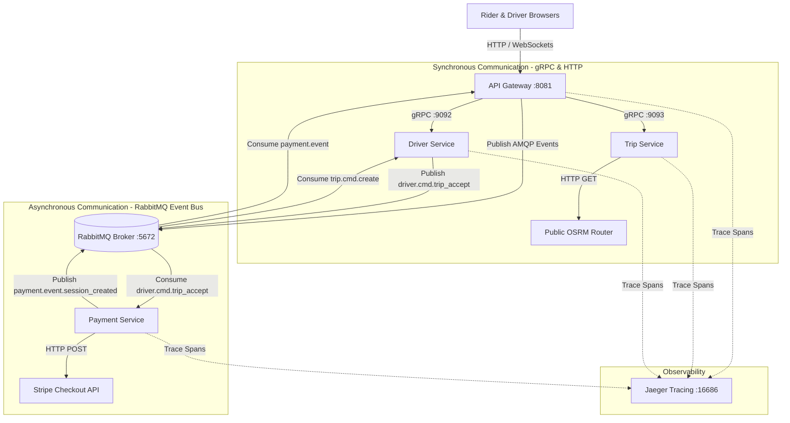

# 🚕 Anshita's Ride-Sharing Platform: Complete Technical & Architectural Guide

Welcome to the comprehensive technical documentation for **Anshita's Ride-Sharing Platform** — a distributed, event-driven microservices application engineered with **Go**, **Kubernetes**, **Docker**, **RabbitMQ**, **Jaeger**, **Stripe**, and **Next.js**.

---

## 🏛️ 1. High-Level System Architecture

The application is built using a **decoupled microservices architecture** combining both **Synchronous (HTTP & gRPC)** and **Asynchronous Event-Driven (RabbitMQ AMQP)** communication:



---

## 🧩 2. Microservices & Component Breakdown

| Component | Technology | Primary Role | Port | Key Protocols |
|---|---|---|---|---|
| **`api-gateway`** | Go (Golang) | Edge router, HTTP REST endpoints, WebSocket hubs, gRPC client, RabbitMQ publisher/consumer | `:8081` | HTTP, WebSockets, gRPC, AMQP |
| **`trip-service`** | Go (Golang) | Calculates trip routes, estimates vehicle fares in Indian Rupees (₹), trip state machine | `:9093` | gRPC, HTTP (OSRM), AMQP |
| **`driver-service`** | Go (Golang) | Driver registration, location streaming, nearby driver matching (Anshita Verma) | `:9092` | gRPC, AMQP |
| **`payment-service`** | Go (Golang) | Integrates with Stripe Checkout, generates payment sessions, processes webhooks | `:9094` | Stripe API, AMQP |
| **`web`** | Next.js 15, React, Leaflet | Frontend user interface for Riders and Drivers with interactive Leaflet maps | `:3000` | HTTP, WebSockets |
| **`rabbitmq`** | Erlang / StatefulSet | Central message broker handling asynchronous queues and event exchanges | `:5672` / `:15672` | AMQP |
| **`jaeger`** | OpenTelemetry | Distributed tracing for tracking latency and end-to-end request flows | `:16686` | OTLP |

---

## 🔄 3. Step-by-Step Technical Execution Flows

### 📍 Flow 1: Trip Preview & Fare Calculation (Synchronous gRPC)

```
Rider UI  ──(POST /trip/preview)──>  API Gateway  ──(gRPC)──>  Trip Service  ──(HTTP)──>  OSRM Router
                                                                     │
                                                       Calculates Fares in ₹ (INR)
                                                                     │
Rider UI  <──(JSON Fares & Route)──  API Gateway  <──(gRPC)──────────┘
```

1. **User Action**: Rider clicks a destination point on the Sarjapur, Bangalore map.
2. **API Call**: `POST http://127.0.0.1:8081/trip/preview` with `pickup` and `destination` coordinates.
3. **Gateway Handling**: `api-gateway` parses JSON request and calls gRPC `trip-service.PreviewTrip`.
4. **OSRM Route Fetch**: `trip-service` issues an HTTP GET request to `https://router.project-osrm.org/route/v1/driving/...` to obtain exact road coordinates, distance, and duration.
5. **Fare Calculation**: `trip-service` computes prices in **Indian Rupees (₹)** for 4 packages (`SUV`, `Sedan`, `Van`, `Luxury`).
6. **Response**: Rider UI renders the calculated route polyline on the map along with the 4 fare options.

---

### 🚗 Flow 2: Trip Request & Driver Matching (Async AMQP)

1. **User Action**: Rider selects a ride package (e.g. Sedan) and clicks **"Request Ride"**.
2. **WebSocket Message**: `{"type":"rider.cmd.trip_create", "pickup": {...}, "destination": {...}}`.
3. **Event Publishing**: `api-gateway` publishes an AMQP message with routing key `trip.cmd.create` to **RabbitMQ**.
4. **Queue Consumption**: `driver-service` listens to `driver_service_queue`, consumes the event, and finds the assigned driver (**Anshita Verma**).
5. **Driver Notification**: `driver-service` broadcasts `driver.event.matched` via `api-gateway` to the Driver UI tab.

---

### 💳 Flow 3: Driver Acceptance & Real Stripe Payment (Async AMQP & External API)

```
Driver Tab  ──(Accept)──>  API Gateway  ──(AMQP)──>  RabbitMQ  ──>  Payment Service
                                                                         │
                                                                   Stripe API (sk_test_...)
                                                                         │
Rider Tab   <──(WebSocket)──  API Gateway  <──(AMQP)──  RabbitMQ  <──────┘
```

1. **User Action**: Driver (**Anshita Verma**) clicks **"Accept Ride"**.
2. **Gateway Event**: `api-gateway` receives WebSocket message and publishes AMQP event `driver.cmd.trip_accept` to RabbitMQ.
3. **Stripe Checkout Creation**: `payment-service` consumes `driver.cmd.trip_accept` and calls the official **Stripe API** (`https://api.stripe.com/v1/checkout/sessions`) using secret key `sk_test_51U2TgoF...`.
4. **Session Broadcast**: Stripe returns a session ID (`cs_test_...`). `payment-service` publishes `payment.event.session_created` to RabbitMQ.
5. **UI Rendering**: `api-gateway` forwards `payment.event.session_created` over WebSocket to the Rider UI.
6. **Payment Redirection**: Rider UI displays the **"Pay ₹[Amount] (INR)"** button. Clicking it redirects to Stripe's secure checkout page.

---

## 🛠️ 4. Understanding Developer Tools (Tilt, RabbitMQ, Jaeger, Docker)

### 🟢 1. Tilt (`http://localhost:10350`)
- **Role**: Development orchestrator.
- **How it works**: Monitors code changes in Go and Next.js. On Windows, it executes binary builds (`cmd /c infra\development\docker\*.bat`), updates container images, and restarts Kubernetes pods instantly.

### 🐰 2. RabbitMQ (`http://localhost:15672` | User: `guest`, Pass: `guest`)
- **Role**: Decoupled Event Bus.
- **How to inspect**:
  - **Exchanges**: Look at `amq.topic` where event routing keys (`trip.cmd.create`, `driver.cmd.trip_accept`, `payment.event.session_created`) are routed.
  - **Queues**: Inspect `trip_service_queue`, `driver_service_queue`, `payment_service_queue`, `api_gateway_queue` to observe message consumption rates in real time.

### 🔍 3. Jaeger Distributed Tracing (`http://localhost:16686`)
- **Role**: OpenTelemetry trace visualizer.
- **How to inspect**: Select service `api-gateway` $\rightarrow$ Find Traces $\rightarrow$ Open `handleTripPreview`.
- **What it tells you**:
  - Total latency (e.g. `543ms`).
  - Breakdown: `api-gateway` overhead (`24ms`) vs `trip-service` + OSRM route fetch (`517ms`).
  - gRPC status code (`0` = OK).

---

## 🎓 5. Key Architecture Takeaways for Interviews & Reviews

1. **Why gRPC for inter-service calls?**
   - Protocol Buffers (`.proto`) enforce strict API schemas and use HTTP/2 binary encoding for low latency.
2. **Why RabbitMQ for payments & ride requests?**
   - Asynchronous messaging prevents blocking the HTTP connection. If `payment-service` or Stripe experiences a brief delay, the message stays queued safely in RabbitMQ without dropping the trip.
3. **Resilience & Fallbacks**:
   - **Database Fallback**: `trip-service` automatically uses an in-memory repository if MongoDB is offline.
   - **Connection Retries**: `messaging.NewRabbitMQ` implements exponential retries during cluster startup.
